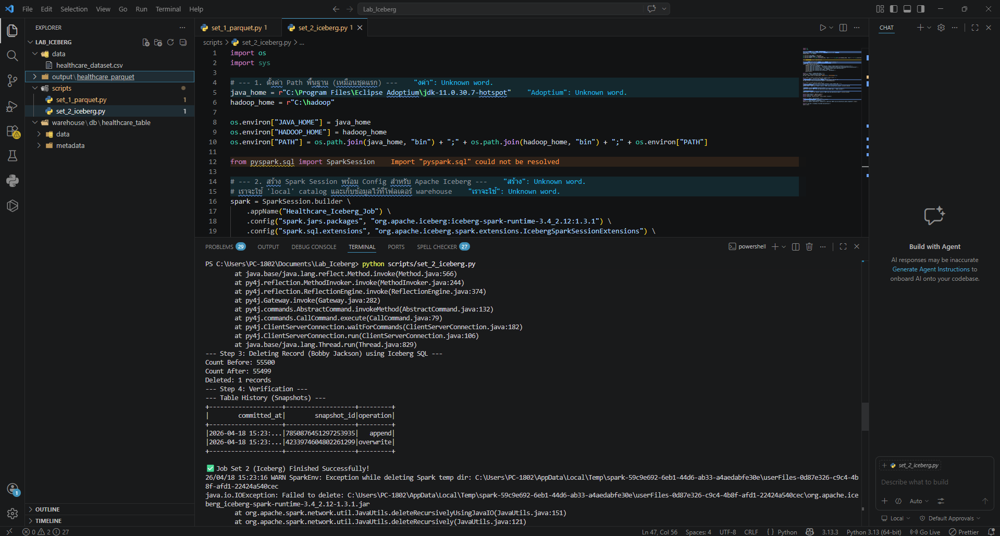

# Healthcare Data Pipeline with Apache Iceberg & Parquet

## โครงสร้างโปรเจกต์
นี่คือโครงสร้างไฟล์ทั้งหมดที่ใช้ใน Lab นี้:

| โฟลเดอร์/ไฟล์ | คำอธิบาย |
| :--- | :--- |
| `scripts/` | เก็บไฟล์ PySpark (.py) |
| `data/` | เก็บข้อมูลดิบ `healthcare_dataset.csv` |
| `output/` | ผลลัพธ์ Parquet (Set 1) |
| `warehouse/` | ผลลัพธ์ Iceberg (Set 2) |
| `result_image/` | เก็บรูปภาพประกอบ |

---

## 🛠️ ผลการรัน

### ชุดที่ 1: Parquet (Immutable File Format)
ใช้ PySpark อ่านข้อมูลดิบ กรองข้อมูล (Bobby JacksOn) และบันทึกเป็น Parquet ไฟล์

---

### ชุดที่ 2: Apache Iceberg (Table Format with Time Travel)
ใช้ PySpark และ Iceberg Catalog ในการสร้างตารางและใช้คำสั่ง `DELETE` (ACID Transaction)

#### Result Screenshot:
